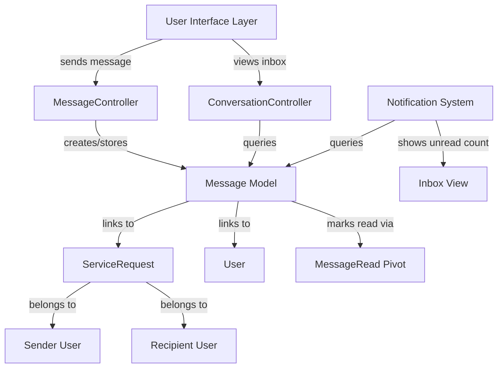

# Design Document: Messaging System

## Overview

The messaging system enables customers and providers to communicate about service requests within ServiLoc. The system supports one-to-one conversations grouped by service request, with read/unread status tracking and simple database-backed storage. Messages are contextually linked to ServiceRequest records, creating a conversation thread for each customer-provider pair per service request. This asynchronous messaging approach allows both parties to negotiate, ask clarifying questions, and maintain a record of all communications related to a service before, during, and after completion.

## Architecture



## Database Schema

### Messages Table

Stores individual messages between users about service requests.

**Table:** `messages`

| Column | Type | Nullable | Description |
|--------|------|----------|-------------|
| id | bigint | No | Primary key |
| service_request_id | bigint | No | Foreign key to service_requests |
| sender_id | bigint | No | Foreign key to users (message author) |
| recipient_id | bigint | No | Foreign key to users (message receiver) |
| body | text | No | Message content |
| created_at | timestamp | No | Message creation time |
| updated_at | timestamp | No | Last update time |

**Constraints:**
- `service_request_id` FOREIGN KEY references `service_requests(id)` ON DELETE CASCADE
- `sender_id` FOREIGN KEY references `users(id)` ON DELETE CASCADE
- `recipient_id` FOREIGN KEY references `users(id)` ON DELETE CASCADE
- Composite index on (service_request_id, sender_id, recipient_id) for conversation queries
- Index on sender_id and recipient_id for inbox queries

### Message Reads Table (Pivot)

Tracks which users have read which messages, supporting read/unread status.

**Table:** `message_reads`

| Column | Type | Nullable | Description |
|--------|------|----------|-------------|
| id | bigint | No | Primary key |
| message_id | bigint | No | Foreign key to messages |
| user_id | bigint | No | Foreign key to users |
| read_at | timestamp | Yes | When message was marked as read |
| created_at | timestamp | No | Record creation time |

**Constraints:**
- `message_id` FOREIGN KEY references `messages(id)` ON DELETE CASCADE
- `user_id` FOREIGN KEY references `users(id)` ON DELETE CASCADE
- Unique constraint on (message_id, user_id) to prevent duplicate reads
- Index on (user_id, read_at) for unread count queries

**Design Rationale:** 
- Pivot table allows tracking read status for each message independently
- The recipient always has a read record; sender doesn't (they created it)
- `read_at` null means unread; timestamp means read
- Enables efficient unread count queries per user

## Components and Interfaces

### 1. Message Model

**Path:** `app/Models/Message.php`

**Relationships:**
- `serviceRequest()` - BelongsTo ServiceRequest
- `sender()` - BelongsTo User (as sender)
- `recipient()` - BelongsTo User (as recipient)
- `reads()` - HasMany MessageRead

**Key Methods:**

```php
// Check if message is read by a specific user
public function isReadBy(User $user): bool

// Mark message as read by a specific user
public function markAsReadBy(User $user): void

// Get unread count for a user
public static function unreadCountForUser(User $user): int

// Get conversation between two users for a request
public static function getConversation(
    ServiceRequest $request,
    User $user1,
    User $user2,
    int $perPage = 20
): Paginator

// Get inbox conversations for a user
public static function getInboxConversations(User $user, int $perPage = 15): Paginator
```

**Attributes:**
- `id` - Primary key
- `service_request_id` - Links to service request
- `sender_id` - User ID of message author
- `recipient_id` - User ID of message receiver
- `body` - Message text content
- `created_at` - Timestamp of creation
- `updated_at` - Timestamp of last update

### 2. MessageRead Model

**Path:** `app/Models/MessageRead.php`

**Relationships:**
- `message()` - BelongsTo Message
- `user()` - BelongsTo User

**Key Methods:**

```php
// Create or update read record
public static function markAsRead(Message $message, User $user): void

// Check if user has read the message
public static function isRead(Message $message, User $user): bool
```

### 3. MessageController

**Path:** `app/Http/Controllers/MessageController.php`

**Key Methods:**

```php
/**
 * Display inbox with conversations
 * GET /messages
 * 
 * Returns paginated list of conversations for authenticated user
 * with unread count for each conversation
 */
public function inbox(Request $request): View

/**
 * Display message thread for a service request
 * GET /messages/{service_request_id}
 * 
 * Shows all messages between sender and recipient for a request
 * Marks all unread messages as read
 * Validates user is participant in conversation
 */
public function show(ServiceRequest $serviceRequest): View

/**
 * Store a new message
 * POST /messages
 * 
 * Validates: message body, recipient exists, user has permission
 * Creates message record
 * Does NOT send real-time notifications (design requirement)
 */
public function store(StoreMessageRequest $request): RedirectResponse

/**
 * Get unread count for authenticated user
 * GET /messages/unread-count
 * 
 * Returns JSON with unread count
 * Used for UI badge in navigation
 */
public function unreadCount(Request $request): JsonResponse

/**
 * Mark messages as read
 * PATCH /messages/{service_request_id}/mark-read
 * 
 * Marks all messages in conversation as read by authenticated user
 */
public function markAsRead(ServiceRequest $serviceRequest): RedirectResponse
```

### 4. ConversationController

**Path:** `app/Http/Controllers/ConversationController.php`

**Key Methods:**

```php
/**
 * List all conversations for authenticated user
 * GET /conversations
 * 
 * Fetches unique conversations grouped by request + other party
 * Includes last message and unread indicator
 * Paginated for performance
 */
public function index(Request $request): View

/**
 * Get conversation detail with messages
 * GET /conversations/{service_request_id}/{other_user_id}
 * 
 * Retrieves all messages between two parties for a request
 * Marks messages as read
 * Returns paginated message thread
 */
public function show(ServiceRequest $serviceRequest, User $otherUser): View

/**
 * Get unread conversations only
 * GET /conversations/unread
 * 
 * Filters conversations to show only those with unread messages
 */
public function unread(Request $request): View
```

## Data Models and Validation

### StoreMessageRequest Form Request

```php
namespace App\Http\Requests;

class StoreMessageRequest extends FormRequest
{
    public function rules(): array
    {
        return [
            'service_request_id' => 'required|exists:service_requests,id',
            'recipient_id' => 'required|exists:users,id|different:auth.id',
            'body' => 'required|string|min:1|max:2000',
        ];
    }

    public function authorize(): bool
    {
        $serviceRequest = ServiceRequest::findOrFail($this->service_request_id);
        // Only participants in the service request can message
        return auth()->id() === $serviceRequest->user_id || 
               auth()->id() === $serviceRequest->assigned_provider_id;
    }
}
```

**Validation Rules:**
- Message body: Required, string, 1-2000 characters
- Recipient: Must exist, cannot be self
- Service request: Must exist, user must be participant
- Sender: Authenticated user
- Permission: User must be customer or assigned provider for request

## Routes and API Structure

```php
// Messaging routes - all require auth middleware
Route::middleware(['auth', 'verified'])->group(function () {
    
    // Inbox view with conversations
    Route::get('/messages', [MessageController::class, 'inbox'])->name('messages.inbox');
    
    // Show conversation thread for a request
    Route::get('/messages/{serviceRequest}', [MessageController::class, 'show'])
        ->name('messages.show');
    
    // Store new message
    Route::post('/messages', [MessageController::class, 'store'])
        ->name('messages.store');
    
    // Mark conversation as read
    Route::patch('/messages/{serviceRequest}/mark-read', [MessageController::class, 'markAsRead'])
        ->name('messages.mark-read');
    
    // API: Get unread count for UI badge
    Route::get('/api/messages/unread-count', [MessageController::class, 'unreadCount'])
        ->name('api.messages.unread-count');
});
```

## Views and Templates

### 1. Inbox View (`resources/views/messages/inbox.blade.php`)

Displays list of conversations with:
- Participant name and avatar
- Last message preview (truncated)
- Unread badge showing count
- Last message timestamp
- Link to open full conversation
- Empty state when no messages

**Structure:**
```
┌─────────────────────────────┐
│ Conversations (Unread: 3)  │
├─────────────────────────────┤
│ [Avatar] John Smith         │
│ "Can you start earlier..."  │
│         2 days ago  [3]     │
├─────────────────────────────┤
│ [Avatar] Jane Doe           │
│ "Great work on the job!"    │
│         5 days ago  [✓]     │
├─────────────────────────────┤
│ No more conversations       │
└─────────────────────────────┘
```

### 2. Conversation Detail View (`resources/views/messages/show.blade.php`)

Displays message thread with:
- Participant info and request context at top
- Chronological message thread
- Read indicators (subtle styling for read messages)
- Message composition form at bottom
- Back to inbox link
- Request status and details sidebar

**Structure:**
```
┌──────────────────────────────────────┐
│ Messages with John Smith             │
│ Service: Plumbing Fix - Living Room  │
│ Request: #1234 | Status: Assigned    │
├──────────────────────────────────────┤
│                                      │
│ [John] "When can you come by?"      │
│ May 10, 2:30 PM                      │
│                                      │
│ [You]  "I'm available Tuesday"       │
│ May 10, 3:15 PM  [Read]              │
│                                      │
│ [John] "Perfect, see you then!"     │
│ May 10, 3:20 PM                      │
│                                      │
├──────────────────────────────────────┤
│ [Message input field...]             │
│ [Send Button]                        │
└──────────────────────────────────────┘
```

### 3. Message Form Component

Reusable form for composing messages:
- Textarea for message body
- Character count (shows as you type)
- Send button (disabled if empty)
- Validation error display
- Hidden service_request_id and recipient_id fields

## Key Algorithms and Logic

### Algorithm 1: Fetch Inbox Conversations

**Purpose:** Get all conversations for a user, optimized for inbox display

```
ALGORITHM getInboxConversations(user)
INPUT: user (authenticated User object)
OUTPUT: conversations (Collection of grouped messages with metadata)

BEGIN
  // Query all messages where user is sender or recipient
  messages ← Query:
    WHERE (sender_id = user.id OR recipient_id = user.id)
    ORDER BY created_at DESC
  
  // Group messages by (service_request_id, other_participant)
  conversations ← EmptyDict
  
  FOR each message IN messages DO
    otherUserId ← IF sender_id = user.id 
                    THEN recipient_id 
                    ELSE sender_id
    
    conversationKey ← (service_request_id, otherUserId)
    
    IF conversationKey NOT IN conversations THEN
      conversations[conversationKey] ← {
        serviceRequestId: message.service_request_id,
        otherUser: User.find(otherUserId),
        lastMessage: message,
        unreadCount: CountUnreadMessages(user, conversationKey),
        serviceRequest: ServiceRequest.find(message.service_request_id)
      }
    END IF
  END FOR
  
  RETURN Paginate(conversations, 15 per page)
END
```

**Preconditions:**
- User is authenticated
- User has at least one message in system

**Postconditions:**
- Returns paginated collection of conversations
- Each conversation includes other party, last message, unread count
- Results ordered by most recent message first

**Performance Optimization:**
- Use single query with eager loading of relationships
- Index on (sender_id, recipient_id, created_at)
- Limit results to 15 per page

### Algorithm 2: Mark Message as Read

**Purpose:** Track that a user has read a message

```
ALGORITHM markMessageAsRead(message, user)
INPUT: message (Message object), user (User object)
OUTPUT: void

BEGIN
  // Check if already has read record
  existingRead ← Query MessageRead 
    WHERE message_id = message.id 
    AND user_id = user.id
  
  IF existingRead EXISTS THEN
    // Already read, nothing to do
    RETURN
  END IF
  
  // Create read record with current timestamp
  messageRead ← new MessageRead{
    message_id: message.id,
    user_id: user.id,
    read_at: NOW()
  }
  messageRead.save()
  
END
```

**Preconditions:**
- Message exists
- User exists
- User is the intended recipient of the message

**Postconditions:**
- MessageRead record exists for this user-message pair
- read_at timestamp is set to current time
- Duplicate reads are prevented via unique constraint

**Loop Invariants:** N/A (no loops)

### Algorithm 3: Get Unread Count for User

**Purpose:** Get total number of unread messages for a user (for UI badge)

```
ALGORITHM getUnreadCountForUser(user)
INPUT: user (User object)
OUTPUT: unreadCount (Integer)

BEGIN
  // Find all messages where user is recipient
  recipientMessages ← Query Message
    WHERE recipient_id = user.id
  
  // Count messages WITHOUT a read record for this user
  unreadCount ← 0
  
  FOR each message IN recipientMessages DO
    hasReadRecord ← Query MessageRead
      WHERE message_id = message.id 
      AND user_id = user.id
      AND read_at IS NOT NULL
    
    IF hasReadRecord NOT FOUND THEN
      unreadCount ← unreadCount + 1
    END IF
  END FOR
  
  RETURN unreadCount
END
```

**Preconditions:**
- User is authenticated

**Postconditions:**
- Returns integer count of unread messages
- Count includes only messages where user is recipient
- Count includes only messages not yet marked as read

**Optimization:** Use single SQL COUNT query with LEFT JOIN on MessageRead table:
```sql
SELECT COUNT(m.id)
FROM messages m
LEFT JOIN message_reads mr ON m.id = mr.message_id 
  AND mr.user_id = ? 
WHERE m.recipient_id = ? 
  AND mr.id IS NULL
```

### Algorithm 4: Check Message Permission

**Purpose:** Verify user is allowed to view/interact with a message

```
ALGORITHM canUserAccessMessage(user, message)
INPUT: user (User), message (Message)
OUTPUT: hasPermission (Boolean)

BEGIN
  // User must be either sender or recipient
  isSender ← message.sender_id = user.id
  isRecipient ← message.recipient_id = user.id
  
  IF NOT (isSender OR isRecipient) THEN
    RETURN false
  END IF
  
  // User must be participant in the service request
  serviceRequest ← ServiceRequest.find(message.service_request_id)
  isCustomer ← serviceRequest.user_id = user.id
  isProvider ← serviceRequest.assigned_provider_id = user.id
  
  IF NOT (isCustomer OR isProvider) THEN
    RETURN false
  END IF
  
  RETURN true
END
```

**Preconditions:**
- User is authenticated
- Message and ServiceRequest exist

**Postconditions:**
- Returns boolean indicating access permission
- Returns true only if user is message participant AND request participant

## Correctness Properties

### Property 1: Message Immutability
**Assertion:** A message, once created, cannot be modified or deleted by the user.
```
∀ message ∈ Message: 
  message.updated_at = message.created_at 
  ∧ message.body is original content
```

### Property 2: One-Way Read Status
**Assertion:** Only the recipient can mark a message as read; sender cannot mark own message as read.
```
∀ message ∈ Message, user ∈ User:
  message.isReadBy(user) ⟹ user.id = message.recipient_id
```

### Property 3: Conversation Isolation
**Assertion:** A user can only see messages in conversations where they are a participant.
```
∀ user ∈ User, message ∈ Message, conversation ∈ Conversation:
  user.canViewConversation(conversation) ⟹ 
  (user.id = message.sender_id ∨ user.id = message.recipient_id)
```

### Property 4: Referential Integrity
**Assertion:** Every message is linked to an existing service request and valid users.
```
∀ message ∈ Message:
  ∃ serviceRequest ∈ ServiceRequest: message.service_request_id = serviceRequest.id
  ∧ ∃ sender ∈ User: message.sender_id = sender.id
  ∧ ∃ recipient ∈ User: message.recipient_id = recipient.id
```

### Property 5: No Self-Messages
**Assertion:** A user cannot send a message to themselves.
```
∀ message ∈ Message:
  message.sender_id ≠ message.recipient_id
```

### Property 6: Unread Count Accuracy
**Assertion:** Unread count equals total recipient messages minus those with read records.
```
unreadCount(user) = |{m ∈ Message : m.recipient_id = user.id ∧ ¬m.isReadBy(user)}|
```

## Error Handling

### Scenario 1: Unauthorized Access to Conversation

**Condition:** User attempts to view a conversation they're not part of
**Response:** Return 403 Forbidden with generic message
**Recovery:** Redirect to inbox with error flash message "You don't have permission to view this conversation"
**Implementation:** Middleware or controller authorization check

### Scenario 2: Invalid Service Request

**Condition:** Message sent with service_request_id that doesn't exist
**Response:** Validation error returned, message not created
**Recovery:** Form redisplayed with validation error "Invalid service request"
**Implementation:** Form validation via StoreMessageRequest

### Scenario 3: Recipient Not Found

**Condition:** User tries to message a recipient who doesn't exist
**Response:** Validation error returned
**Recovery:** Form redisplayed with error "Recipient not found"
**Implementation:** exists:users validation rule in form request

### Scenario 4: User Not Request Participant

**Condition:** User tries to send message about a request they don't participate in
**Response:** 403 Forbidden returned
**Recovery:** Redirect to dashboard
**Implementation:** Custom authorization logic in StoreMessageRequest::authorize()

### Scenario 5: Empty Message Body

**Condition:** User submits form with empty message
**Response:** Validation error "Message cannot be empty"
**Recovery:** Form redisplayed with message preserved, validation error shown
**Implementation:** required|min:1 validation rule

### Scenario 6: Message Too Long

**Condition:** User attempts to send message over 2000 characters
**Response:** Validation error "Message too long (max 2000 characters)"
**Recovery:** Form redisplayed with character count indicator
**Implementation:** max:2000 validation rule

## Permission Matrix

| Action | Customer | Provider | Admin | Notes |
|--------|----------|----------|-------|-------|
| Send message about own request | ✓ | ✗ | ✗ | Only to assigned provider |
| Send message to customer | ✓ (if assigned) | ✓ | ✗ | Only about assigned request |
| View own inbox | ✓ | ✓ | ✗ | See own conversations |
| View conversation | ✓ (if participant) | ✓ (if participant) | ~ | Admin can view for support |
| Mark messages read | ✓ | ✓ | ~ | Only recipient can mark read |
| Delete message | ✗ | ✗ | ~ | Messages are immutable |

**Notes:**
- ~ = Admin has access (not covered in basic MVP)
- ✗ = Feature not available for this role
- ✓ = Feature available with conditions

## Testing Strategy

### Unit Testing

**Message Model Tests:**
- Test isReadBy() returns correct boolean
- Test markAsReadBy() creates read record
- Test getUnreadCount() calculates correctly
- Test relationships (serviceRequest, sender, recipient, reads)
- Test message cannot be sent to self validation

**MessageRead Model Tests:**
- Test markAsRead() creates record with timestamp
- Test isRead() returns correct status
- Test unique constraint on (message_id, user_id)

**Form Request Tests:**
- Test StoreMessageRequest validates required fields
- Test authorization fails for non-participants
- Test authorization succeeds for valid participants
- Test max length validation on message body

### Integration Testing

**Messaging Flow Tests:**
- Test complete flow: Send message → Receive → Mark read → View in inbox
- Test permission checks prevent unauthorized access
- Test pagination on large conversation threads
- Test cascade delete removes messages when service request deleted
- Test cascade delete removes reads when message deleted

**Inbox Tests:**
- Test inbox shows all conversations in correct order
- Test unread count displays correctly in inbox
- Test conversation grouping works (same request, same parties)
- Test empty inbox displays properly

### Property-Based Testing

**Test Library:** Use fast-check for JavaScript or PHPUnit with property-based extensions

**Properties to Test:**
1. **Idempotent Reads:** Marking same message as read twice produces same result
2. **Conversation Consistency:** All messages in conversation grouped correctly
3. **Unread Count Monotonicity:** Marking message as read never increases unread count
4. **Permission Symmetry:** If A can message B about request, they appear in each other's inbox

## Performance Considerations

### Query Optimization

1. **Inbox Query:**
   - Create composite index on (sender_id, recipient_id, created_at)
   - Use eager loading for relationships (User, ServiceRequest)
   - Implement pagination at 15 conversations per page
   - Cache unread counts with cache invalidation on new message

2. **Conversation Thread:**
   - Index on (service_request_id, sender_id, recipient_id)
   - Load messages in reverse chronological order with pagination
   - Lazy load read status on demand or with left join

3. **Unread Count:**
   - Use efficient SQL COUNT query with LEFT JOIN
   - Cache result with 5-minute TTL
   - Invalidate cache when message marked as read

### Database Considerations

- Message table will grow over time; consider archival strategy for old messages
- MessageRead table will have many records; indexes crucial for performance
- Use soft deletes if message deletion needed in future

### UI Performance

- Paginate message threads (load 20 per page initially, lazy load more)
- Debounce character counter updates (250ms)
- Minimize re-renders when marking messages as read
- Cache conversation list with background refresh

## Security Considerations

### Access Control

1. **Message Visibility:**
   - Users can only see messages they participated in
   - Implement authorization checks in controller and policy class
   - Use middleware to verify participant status on protected routes

2. **Cross-Request Communication:**
   - Users cannot message about requests they're not involved with
   - ServiceRequest participant check mandatory for all message operations

3. **Account Takeover Prevention:**
   - Rate limit message sending (max 50 messages per hour per user)
   - Log all message activity for audit trail
   - Validate CSRF tokens on all POST requests

### Input Security

1. **XSS Prevention:**
   - Sanitize message body on display using Blade's {{{ }}} escaping
   - Store raw text in database, escape on output
   - Never use unescaped {!! !!} for message display

2. **SQL Injection:**
   - Use parameterized queries via Laravel's query builder
   - Never concatenate user input into raw queries
   - Use Eloquent ORM for all database operations

3. **Message Body Validation:**
   - Enforce max length (2000 characters) to prevent abuse
   - No file uploads or HTML allowed in message body
   - Strip or reject special characters if needed

### Privacy

1. **Message Privacy:**
   - Only sender and recipient can access message
   - Implement row-level security checks
   - Never expose message list without auth

2. **User Data:**
   - Don't expose user IDs in URLs (use route model binding)
   - Implement authorization checks before returning user data
   - Log access to conversations for security audit

3. **Read Status Privacy:**
   - Don't expose read status to non-participants
   - Read status only visible to sender and recipient
   - Don't share read patterns with third parties

## Migration Strategy

### Phase 1: Database Setup
- Create messages table
- Create message_reads table
- Create necessary indices

### Phase 2: Model & Business Logic
- Create Message model with relationships
- Create MessageRead model
- Implement business logic methods

### Phase 3: Controllers
- Create MessageController
- Create ConversationController
- Implement authorization and validation

### Phase 4: Views
- Create inbox view
- Create conversation detail view
- Create message form component
- Update navigation with message badge

### Phase 5: Testing
- Write and run unit tests
- Write and run integration tests
- Manual testing of complete workflows

### Phase 6: Deployment
- Run migration in production
- Deploy code changes
- Monitor for errors and performance
- Notify users about new messaging feature

## Dependencies

**Laravel Packages:**
- Laravel 11 (core framework)
- Laravel Breeze (authentication - already included)
- Laravel Tinker (debugging - already included)

**Database:**
- SQLite (development)
- Supports PostgreSQL/MySQL for production

**Frontend:**
- Blade templating engine
- Tailwind CSS (styling - already included)
- Alpine.js (interactivity - optional, for dynamic badge updates)

**No external dependencies required** - system uses Laravel built-ins only

